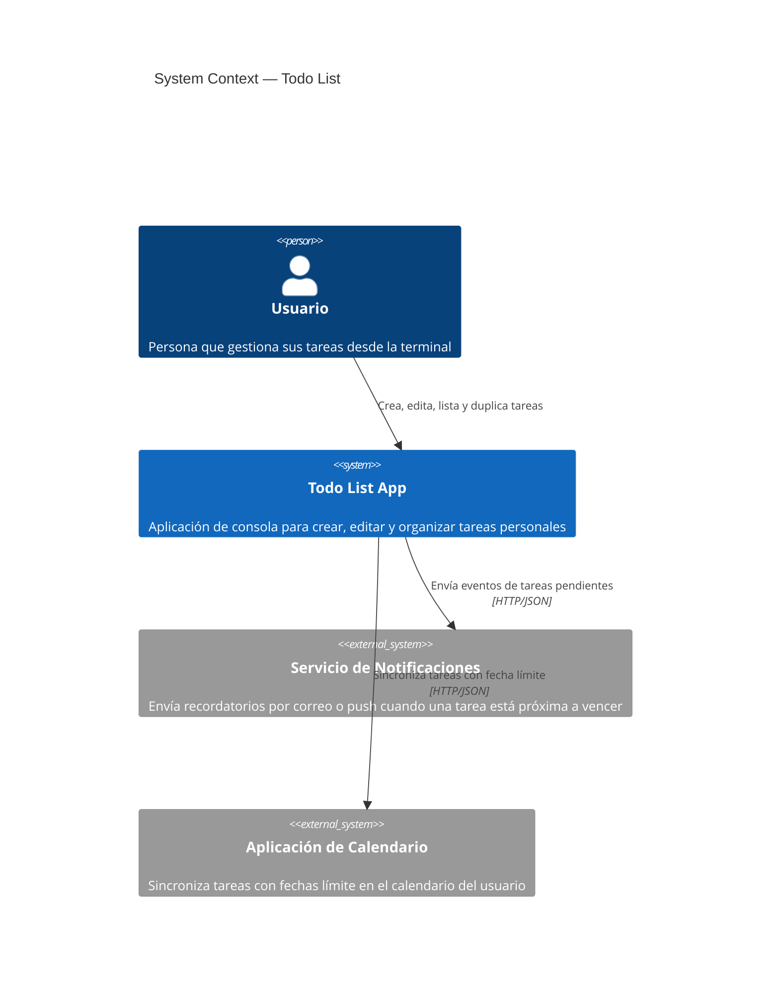
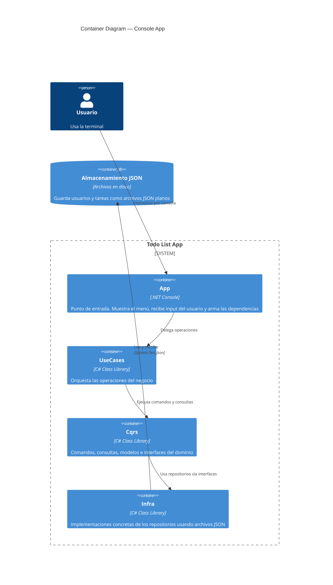
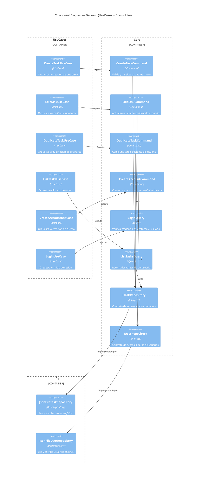
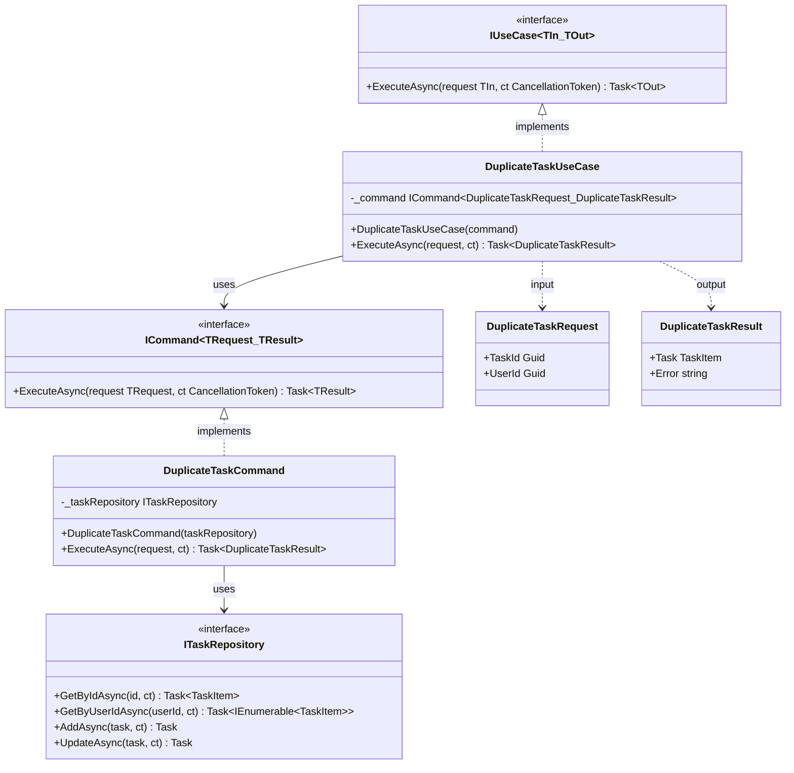

# C4 Model — Todo List

---

## Nivel 1: System Context Diagram

Quién usa el sistema y con qué aplicaciones externas se comunica.

---

## Nivel 2: Container Diagram

Cómo está organizada internamente la consola app.

---

## Nivel 3: Component Diagram

Qué hay dentro del "Backend": UseCases, Commands, Queries y Repositories.

---

## Nivel 4: Code Diagram

Detalle de `DuplicateTaskUseCase` — cómo se conectan las clases a nivel de código.

